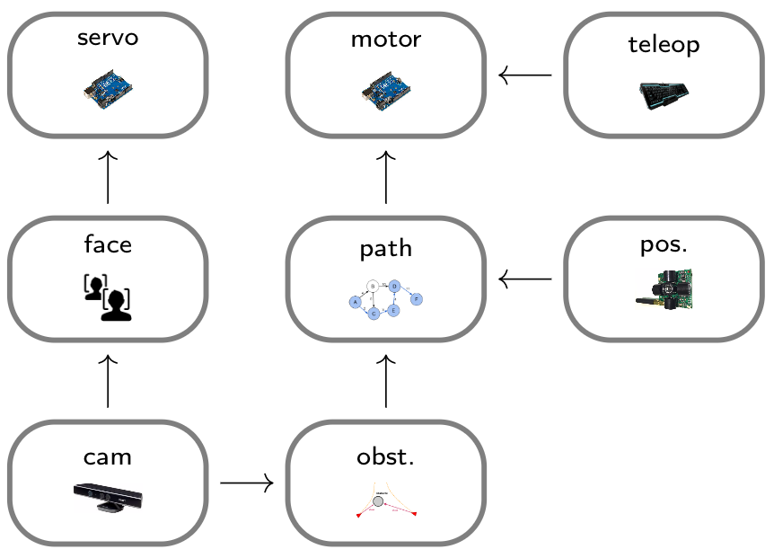

# meccanoid-ros-packages

ros packages for the meccanoid-tx1




## Install scripts

1. Put each of the following code snippets in separate files: ` your_file1.sh, your_file2.sh, ...` 
2. Make executable by running `$ chmod +x your_fileX.sh`
3. Execute each script as super user by running `$ sudo ./your_fileX.sh`.

#### Robot operating system

This script will clone install scripts from Jetsonhacks, execute them and fix permission issues. Default version is ROS Kinetic Base, if you need another version just clone the repo from Jetsonhacks and modify the install scripts prior to executing them.

```bash
#!/bin/bash

# url for jetsonhacks ROS kinetic install scripts
repo="https://github.com/jetsonhacks/installROSTX1.git"

# clone scripts to homefolder
git clone "$repo" "/home/ubuntu/ros_install"

# update repos
. '/home/ubuntu/ros_install/updateRepositories.sh'

# install ROS
. '/home/ubuntu/ros_install/installROS.sh'

# fix dependency issues since script should be called by super user
rosdep fix-permissions
rosdep update
```

#### Kinect drivers

This script will install Kinect drivers and disable usb auto-suspend. If usb auto suspend is on, the data stream from the Kinect camera is killed.

```bash
#!/bin/bash

# ----------------------------------------------------
# Jetpack 2.3 pre-installs the following dependencies
# ----------------------------------------------------
# apt-get install freeglut3-dev
# apt-get install pkg-config
# apt-get install build-essential
# apt-get install libxmu-dev
# apt-get install libxi-dev
# ----------------------------------------------------

# libusb 1.0 development headers
apt-get install libusb-1.0-0-dev

# Add ubuntu launchpad repository
add-apt-repository ppa:floe/libtisch
apt-get update

# Install freenect driver, development headers and demo apps
apt-get install freenect libfreenect-dev libfreenect-demos

# Add user to plugdec
adduser $USER plugdev

# Disable usb auto suspend from boot up script hence forward
sed -i '$s/$/ usbcore.autosuspend=-1/' /boot/extlinux/extlinux.conf

# Disable usb auto suspend for the current session 
bash -c 'echo -1 > /sys/module/usbcore/parameters/autosuspend'
```

#### ROS Kinect node

This script will install the ROS openni Kinect node for the Kinetic distribution which is used for publishing image data from the Kinect camera to a ROS topic. If you have another ROS distribution change `kinetic` to your distribution name eg. `install ros-your_distribution_name-openni-camera`.

```bash
#!/bin/bash

# install ros kinect driver for publishing sensor_msgs/Image see: wiki.ros.org/openni_camera
apt-get install ros-kinetic-openni-camera

# install ros kinect launch stack, lots of stuff.. see: wiki.ros.org/openni_launch
apt-get install ros-kinetic-openni-launch

# install image view package see: wiki.ros.org/image_view
apt-get install ros-kinetic-image-view
```

#### ROS Serial (arduino) node

This script will install the ROS serial node for communication over serial ports.

```bash
#!/bin/bash

# Ardiuno specific extensions, see: http://wiki.ros.org/rosserial_arduino
apt-get install ros-kinetic-rosserial-arduino

# ROS Serial protocol, see: http://wiki.ros.org/rosserial
apt-get install ros-kinetic-rosserial
```

Then set up ros_lib in the arduino environment by typing the following: (where `<sketchbook>` is the path of your Arduino sketchbook libraries)
 
```bash
$ cd <sketchbook>/libraries
$ rm -rf ros_lib
$ rosrun rosserial_arduino make_libraries.py .
```
